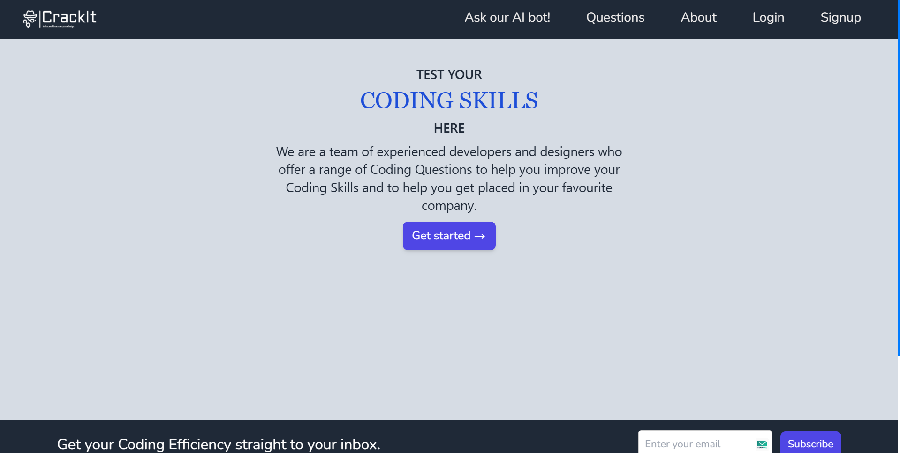
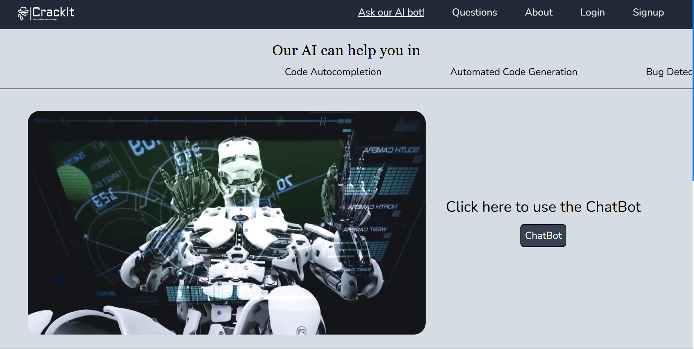
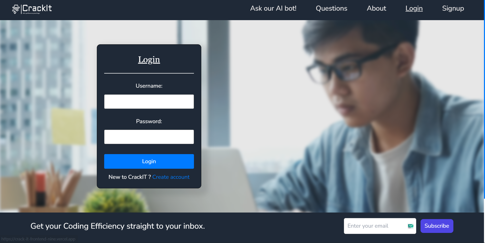

# CrackIT - Frontend

## Overview

CrackIT is a web-based platform designed to help users practice coding challenges, interact with an AI-powered chatbot, and prepare for technical interviews.  
This repository contains the **frontend** of the application, built using **React** with **Tailwind CSS** for styling.

---

## Technologies Used

### Frontend

- **React (Vite)**: JavaScript library for building interactive UIs.
- **TypeScript**: For strong typing and better developer experience.
- **Tailwind CSS**: Utility-first CSS framework for styling.
- **Axios**: For making API calls to the backend.
- **React Router**: For seamless navigation between pages.

### Tools

- **VS Code**: Recommended IDE for development.
- **Node.js + npm**: Package manager and runtime.

---

## Project Aim

The main goal of the frontend is to provide an **intuitive and responsive interface** where users can:

- Register/Login securely.
- Browse and attempt coding problems.
- Interact with an AI chatbot for guidance.
- Manage their profile and submissions.

---

## Key Features

- **Authentication**: Signup, login, logout.
- **Dashboard**: Personalized interface for users.
- **Problem Pages**: Browse and solve coding challenges.
- **AI Chatbot**: Real-time Q&A assistance.
- **Responsive UI**: Optimized for desktop and mobile.

---

## Demonstration

### Project screenshots:

## Home Page: 
  
---
## ChatBot:
  
---
## Login Page:
  

---

## Getting Started

### Prerequisites

- **Node.js (v16+)**
- **npm or yarn**

### Installation

1. **Clone the repository:**
   ```bash
   git clone https://github.com/neelpatel2003/CrackIT-Frontend.git
   cd CrackIT-Frontend
   
2. **Install dependencies:**
   ```bash
   npm install
   ```

3. **Run the Development Server:**
   ```bash
   npm run dev
   ```
### Usage

- Access the frontend application at `http://localhost:5173`.
